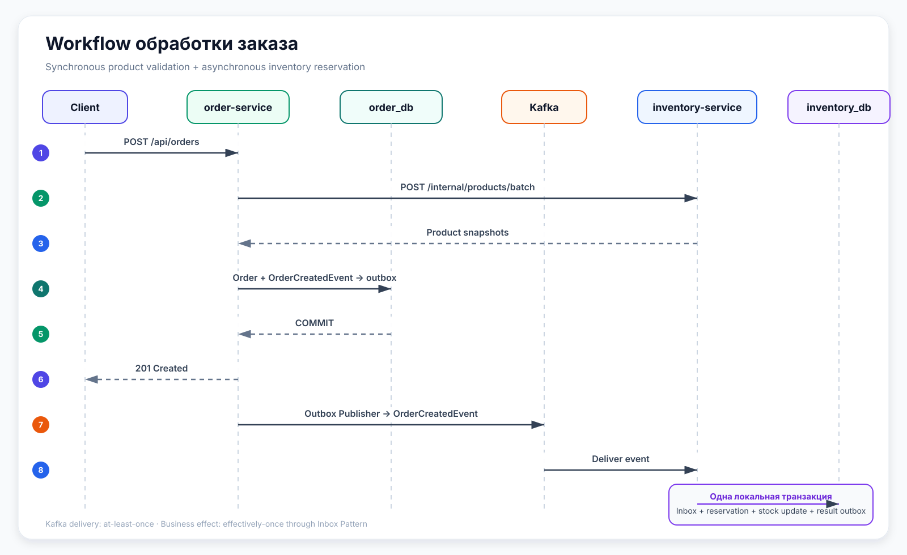

# Order Platform

<div align="center">

[](https://github.com/vkutonov/order-platform/actions/workflows/ci.yml)

**Event-driven backend-платформа для надёжной обработки заказов и управления товарными остатками.**

Java 21 · Spring Boot · PostgreSQL · Apache Kafka · Transactional Outbox · Inbox Pattern

</div>

---

## О проекте

`Order Platform` сочетает синхронное взаимодействие сервисов для получения актуальных данных о товарах и асинхронную обработку резервирования через Apache Kafka.

Каждый сервис владеет собственной базой данных и выполняет только локальные транзакции.

<table>
  <thead>
    <tr>
      <th align="left">Сервис</th>
      <th align="left">Зона ответственности</th>
    </tr>
  </thead>
  <tbody>
    <tr>
      <td><code>order-service</code></td>
      <td>Заказы, позиции заказа, жизненный цикл и история статусов</td>
    </tr>
    <tr>
      <td><code>inventory-service</code></td>
      <td>Товары, складские остатки и резервации</td>
    </tr>
  </tbody>
</table>

## Workflow обработки заказа

<p align="center">
  
</p>

1. Клиент отправляет запрос на создание заказа.
2. `order-service` получает из `inventory-service` актуальные product snapshots.
3. После валидации заказ и `OrderCreatedEvent` сохраняются в одной транзакции.
4. Outbox Publisher асинхронно публикует событие в Kafka.
5. `inventory-service` идемпотентно обрабатывает событие и резервирует товары.
6. Inbox-запись, резервация, изменение остатков и result event сохраняются атомарно.

## Сильные стороны

- **Event-driven processing** — резервирование выполняется асинхронно через Kafka.
- **Transactional Outbox** — бизнес-данные и integration event сохраняются атомарно.
- **Inbox Pattern** — повторная доставка сообщения не создаёт повторный бизнес-эффект.
- **Retry и DLT** — временные ошибки повторяются, невалидные события отправляются в Dead Letter Topic.
- **Optimistic locking** — защищает складские остатки от конкурентных изменений.
- **Database per service** — каждый сервис владеет своей PostgreSQL database и Flyway migrations.

> Kafka обеспечивает `at-least-once delivery`, а Inbox Pattern даёт `effectively-once business effect`: сообщение может прийти повторно, но резервирование не выполнится второй раз.

## Гарантии надёжности

<table>
  <thead>
    <tr>
      <th align="left">Сценарий</th>
      <th align="left">Гарантия</th>
    </tr>
  </thead>
  <tbody>
    <tr>
      <td>Заказ сохранён, но приложение упало до публикации</td>
      <td><code>OrderCreatedEvent</code> остаётся в Transactional Outbox и будет опубликован повторно</td>
    </tr>
    <tr>
      <td>Kafka повторно доставила событие</td>
      <td><code>processed_events</code> блокирует повторную обработку по <code>eventId</code></td>
    </tr>
    <tr>
      <td>Consumer упал после DB commit, но до offset commit</td>
      <td>Повторная доставка распознаётся как duplicate</td>
    </tr>
    <tr>
      <td>PostgreSQL временно недоступен или возник concurrency conflict</td>
      <td>Локальная транзакция откатывается, после чего выполняется retry</td>
    </tr>
    <tr>
      <td>Event contract нарушен или версия события не поддерживается</td>
      <td>Сообщение классифицируется как non-retryable и отправляется в DLT</td>
    </tr>
    <tr>
      <td>Резервирование завершено, но Kafka временно недоступна</td>
      <td>Результат и result event уже сохранены атомарно в inventory outbox</td>
    </tr>
  </tbody>
</table>

Ожидаемый бизнес-отказ, например недостаток товара, сохраняется как failed reservation и не запускает Kafka retry. Техническая ошибка приводит к rollback всей локальной транзакции.

## Основные API

### Order Service

Базовый адрес: `http://localhost:8081`

<table>
  <thead>
    <tr>
      <th>Метод</th>
      <th align="left">Endpoint</th>
      <th align="left">Назначение</th>
    </tr>
  </thead>
  <tbody>
    <tr>
      <td><code>POST</code></td>
      <td><code>/api/orders</code></td>
      <td>Создать заказ</td>
    </tr>
    <tr>
      <td><code>GET</code></td>
      <td><code>/api/orders/{id}</code></td>
      <td>Получить заказ по ID</td>
    </tr>
    <tr>
      <td><code>GET</code></td>
      <td><code>/api/orders/user/{userId}</code></td>
      <td>Получить заказы пользователя</td>
    </tr>
    <tr>
      <td><code>GET</code></td>
      <td><code>/api/orders/{id}/history</code></td>
      <td>Получить историю статусов заказа</td>
    </tr>
  </tbody>
</table>

Пример запроса:

```json
{
  "userId": "8d2c8c3d-fc8f-4f7a-9a9b-9a1e0a0a0001",
  "items": [
    {
      "productId": "2c6ad9f2-3d7b-4b3a-a93b-6e98c6a00001",
      "quantity": 2
    }
  ]
}
```

Клиент не передаёт название, цену и валюту. `order-service` получает эти данные из `inventory-service` и сохраняет snapshot позиции заказа на момент создания.

### Inventory Service

Базовый адрес: `http://localhost:8082`

<table>
  <thead>
    <tr>
      <th>Метод</th>
      <th align="left">Endpoint</th>
      <th align="left">Назначение</th>
    </tr>
  </thead>
  <tbody>
    <tr>
      <td><code>POST</code></td>
      <td><code>/api/products</code></td>
      <td>Создать товар</td>
    </tr>
    <tr>
      <td><code>POST</code></td>
      <td><code>/api/products/{id}/stock</code></td>
      <td>Пополнить складской остаток</td>
    </tr>
    <tr>
      <td><code>GET</code></td>
      <td><code>/api/products/{id}/stock</code></td>
      <td>Получить состояние остатка</td>
    </tr>
    <tr>
      <td><code>POST</code></td>
      <td><code>/internal/products/batch</code></td>
      <td>Получить product snapshots для внутренних сервисов</td>
    </tr>
  </tbody>
</table>

`/internal/**` предназначен для межсервисного взаимодействия и не является пользовательским API.

## Валидация и обработка ошибок

Валидация выполняется на нескольких уровнях:

- Jakarta Validation проверяет обязательные поля, вложенные items и положительное quantity;
- application validation проверяет наличие товаров, статус `ACTIVE` и единую валюту заказа;
- domain rules защищают lifecycle transitions и операции с остатками;
- Kafka consumer проверяет event contract и поддерживаемую `eventVersion`;
- database constraints остаются последней границей консистентности.

REST API возвращает единый error response со стабильным `ApiErrorCode`, HTTP status и `fieldErrors`. Ошибки Kafka-контракта обрабатываются отдельно через Kafka Error Handler и DLT.

## Technology Stack

`Java 21` · `Spring Boot 4.1` · `Spring Web MVC` · `Spring Data JPA` · `Apache Kafka` · `PostgreSQL` · `Flyway` · `Docker Compose` · `MapStruct` · `OpenAPI` · `JUnit 5` · `Mockito` ·  `Testcontainers` · `Gradle`

## Локальный запуск

Создать `.env` из шаблона:

```bash
cp .env.example .env
```

Запустить PostgreSQL, Kafka и Kafka UI:

```bash
docker compose up -d
```

Запустить сервисы в отдельных терминалах:

```bash
cd inventory-service
./gradlew bootRun
```

```bash
cd order-service
./gradlew bootRun
```

Порты по умолчанию:

- `order-service` — `8081`;
- `inventory-service` — `8082`;
- Kafka UI — `8085`.

## Testing и GitHub Actions CI

Проект содержит:

- unit tests для domain rules и service logic;
- Mockito tests для взаимодействия компонентов;
- MockMvc tests для REST API, валидации и error handling;
- integration tests для JPA, PostgreSQL и Flyway migrations;
- tests для Outbox Publisher и Kafka consumer behavior.

Локальный build:

```bash
cd order-service
./gradlew clean build
```

```bash
cd inventory-service
./gradlew clean build
```

GitHub Actions запускает отдельный matrix job для `order-service` и `inventory-service` при Pull Request и push в `master`. При failure test reports сохраняются как workflow artifacts.

## Текущий статус

### Реализовано

- `order-service` и `inventory-service` с отдельными PostgreSQL databases;
- создание заказов, order lifecycle и история статусов;
- товары, складские остатки и резервации;
- получение authoritative product snapshots через HTTP Interface;
- Transactional Outbox и Kafka publishing;
- асинхронная обработка `OrderCreatedEvent`;
- Inbox Pattern и идемпотентность по `eventId`;
- atomic processing: inbox, reservation, stock changes и result outbox;
- retry, non-retryable event errors и Dead Letter Topic;
- Flyway migrations, Docker Compose, автоматические тесты и GitHub Actions CI.

### Следующие этапы

- обработка inventory result events в `order-service`;
- автоматическое изменение статуса заказа после результата резервирования;
- `payment-service` и compensating action для освобождения резервации;
- `notification-service`;
- API Gateway, JWT Security и observability.

> Текущая архитектура является основой choreography-based Saga. Полный Saga workflow будет завершён после добавления оплаты и compensating actions.
